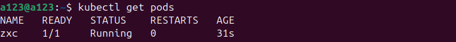
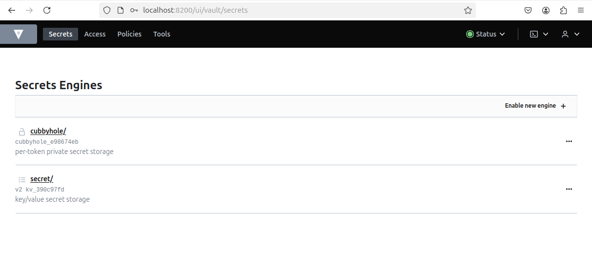
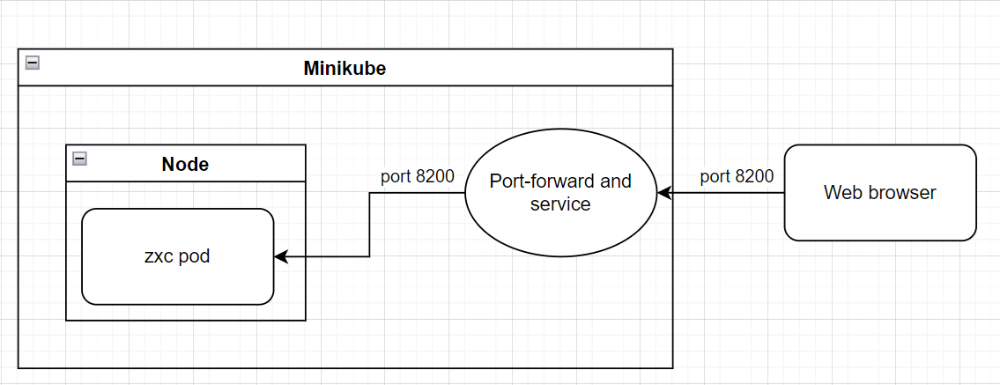

University: [ITMO University](https://itmo.ru/ru/) \
Faculty: [FICT](https://fict.itmo.ru) \
Course: [Introduction to distributed technologies](https://github.com/itmo-ict-faculty/introduction-to-distributed-technologies) \
Year: 2024/2025 \
Group: K4111c \
Author: Litvinova Daria Dmitrievna \
Lab: Lab1 \
Date of create: 12.12.2024 \
Date of finished: -
## Лабораторная работа №1 "Установка Docker и Minikube, мой первый манифест."
## Ход работы
1) После установки `Docker` и `minikube` запустим Minikube для развертывания `minikube cluster`
```bash
minikube start
```
Minikube - это инструмент для запуска локального кластера Kubernetes на компьютере, позволяющий легко тестировать и разрабатывать приложения Kubernetes.
2) Для корректной работы "пода" в данной работе (т.е отсутствие статуса `Pending`) укажем конкретную версию образа `HashiCorp Vault`
```bash 
docker pull vault:1.13.3"
```
Vault - это инструмент для управления секретами, который позволяет безопасно хранить и управлять информацией, такой как пароли и токены.

3) Напишем [манифест](myfirst.yml), где зададим имя "пода" `zxc`

4) Добавим созданый манифест в среду, чтобы создать соответствующий объект (в данной работе контейнер) в кластере
```bash 
kubectl apply -f myfirst.yaml
```
5) Проверим статус "пода" с помощью
```bash
kubectl get pods
```


6) Создадим сервис для доступа к контейнеру, созданного в п.4.
```bash
minikube kubectl -- expose pod zxc --type=NodePort --port=8200
```
7) Для подключения к контейнеру используем 
```bash
minikube kubectl -- port-forward service/zxc 8200:8200
 ```
8) Для получения информации о доспупе к контейнеру с помощью
```bash
kubectl logs zxc
 ```
найдем данные о Root Token


9) Посетим `http://localhost:8200`

10) После ввода Root Token получаем доступ к vault 


11) Остановим Minikube
 ```bash
minikube stop
``` 
Таким образом в данной работе были установлены `docker` и `minikube` и был развернут первый "под".

12) Схема организации контейнеров представлена ниже:


