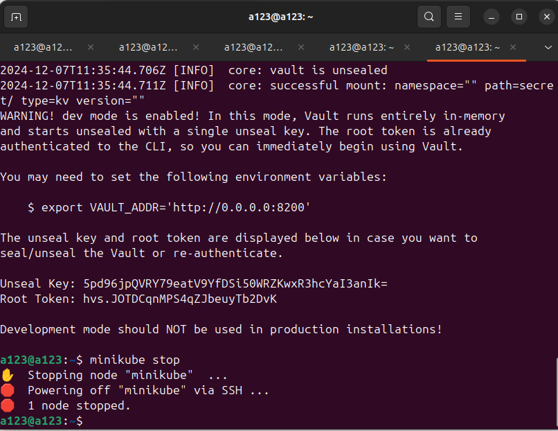

University: [ITMO University](https://itmo.ru/ru/) \
Faculty: [FICT](https://fict.itmo.ru) \
Course: [Introduction to distributed technologies](https://github.com/itmo-ict-faculty/introduction-to-distributed-technologies) \
Year: 2024/2025 \
Group: K4111c \
Author: Litvinova Daria Dmitrievna \
Lab: Lab2 \
Date of create: 08.12.2024 \
Date of finished: -

## Ход работы
1) Запустим Minikube
```bash
minikube start
```
2) Для удобства использования создадим алиас
```bash 
alias kubectl="minikube kubectl --"
```
3) Напишем [манифест](myfirst.yml), где зададим имя пода `zxc`
4) Добавим созданый манифест в кластер
```bash 
kubectl apply -f myfirst.yml
```
5) Проверим статус пода с помощью
```bash
kubectl get pods
```
6) Создадим сервис для доступа к этому контейнеру
```bash
minikube kubectl -- expose pod zxc --type=NodePort --port=8200
```
7) Для подключения к контейнеру используем 
```bash
minikube kubectl -- port-forward service/zxc 8200:8200
 ```
8) Для получения информации о доспупе к контейнер с помощью
```bash
kubectl logs zxc
 ```
найдем данные о Root Token


9) Посетим `http://localhost:8200`

10) После ввода Root Token получаем доступ к vault 


11) Остановим Minikube
 ```bash
minikube stop
``` 
12) Составим схему в draw.io

