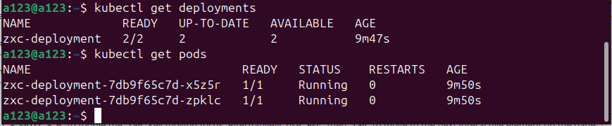
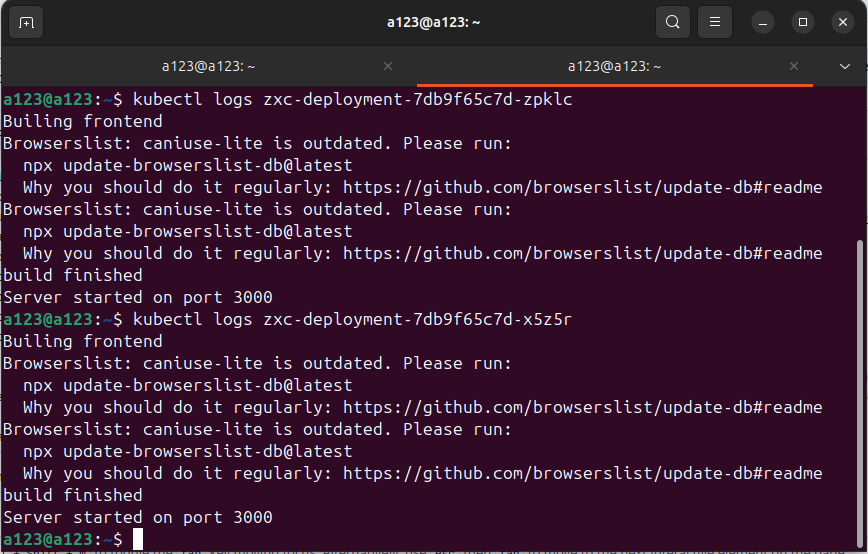

University: [ITMO University](https://itmo.ru/ru/) \
Faculty: [FICT](https://fict.itmo.ru) \
Course: [Introduction to distributed technologies](https://github.com/itmo-ict-faculty/introduction-to-distributed-technologies) \
Year: 2024/2025 \
Group: K4111c \
Author: Litvinova Daria Dmitrievna \
Lab: Lab2 \
Date of create: 08.12.2024 \
Date of finished: -
## Лабораторная работа №2 "Развертывание веб сервиса в Minikube, доступ к веб интерфейсу сервиса. Мониторинг сервиса."
1. Создадим [файл с конфигурацией](./deployment.yml). Укажем согласно заданию количество реплик `replicas` равное `2`.
2. Запустим minikube
```bash
minikube start
```
3. Добавим созданый deployment с помощью команды
```bash
minikube kubectl -- apply -f deployment.yml
```
4. Проверим добавление объекта `deployment` и наличие `pod`
```bash
kubectl get deployments
```
```bash
kubectl get pods
```


5. Зададим тип сервиса `ClusterIP`, чтобы взаимодействие с серсисом происходило только внутри кластера
```bash
minikube kubectl -- expose deployment zxc-deployment --port=3000 --name=zxc-service --type=ClusterIP
```
6. Пробросим порты, аналагично п. в лабораторной работе 1
```bash
minikube kubectl -- port-forward service/zxc-service 3000:3000
```
7. При переходе на `localhost:3000` получаем следующее:

8. Сравним логи используемых подов в помощью:
```bash
kubectl logs <имя пода>
```

9. Схема организации контейеров и сервисов

