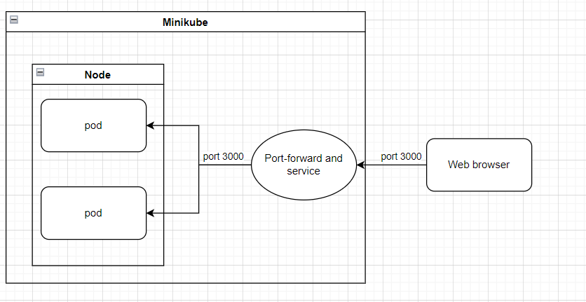

University: [ITMO University](https://itmo.ru/ru/) \
Faculty: [FICT](https://fict.itmo.ru) \
Course: [Introduction to distributed technologies](https://github.com/itmo-ict-faculty/introduction-to-distributed-technologies) \
Year: 2024/2025 \
Group: K4111c \
Author: Litvinova Daria Dmitrievna \
Lab: Lab2 \
Date of create: 12.12.2024 \
Date of finished: -
## Лабораторная работа №2 "Развертывание веб сервиса в Minikube, доступ к веб интерфейсу сервиса. Мониторинг сервиса."
## Ход работы
1. Создадим [файл конфигурации](./deployment.yaml). Укажем согласно заданию количество реплик `replicas` равное `2`.
2. Запустим minikube
```bash
minikube start
```
3. Добавим созданый файл конфигурации с помощью команды
```bash
minikube kubectl -- apply -f deployment.yaml
```
4. Проверим добавление объекта `deployment` и наличие `pod`
```bash
kubectl get deployments
```
```bash
kubectl get pods
```


5. Зададим тип сервиса `ClusterIP`, чтобы взаимодействие с серсисом происходило только внутри кластера
```bash
minikube kubectl -- expose deployment zxc-deployment --port=3000 --name=zxc-service --type=ClusterIP
```
6. Пробросим порты, аналагично п. в лабораторной работе 1
```bash
minikube kubectl -- port-forward service/zxc-service 3000:3000
```
7. При переходе на `localhost:3000` получаем следующее:

Переменные `REACT_APP_USERNAME` и `REACT_APP_COMPANY_NAME` не изменяются в данной работе, поскольку значение этих переменных задается в файле конфигурации. Переменная `Container name`, может изменяться в данной работе, поскольку ее значение зависит от того с каким из созданных контейнеров взаимодействует браузер при переадресации.
8. Сравним логи используемых подов в помощью:
```bash
kubectl logs <имя пода>
```


Можно заметить, что данные логи совпадают 

9. Схема организации контейеров и сервисов

