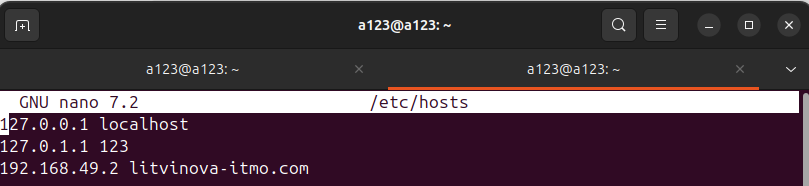
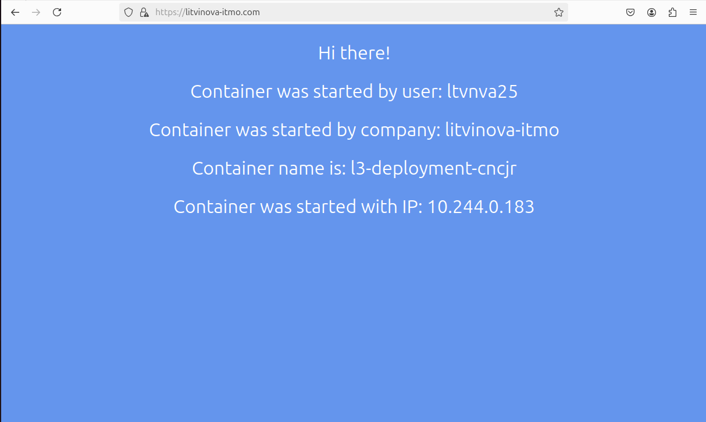
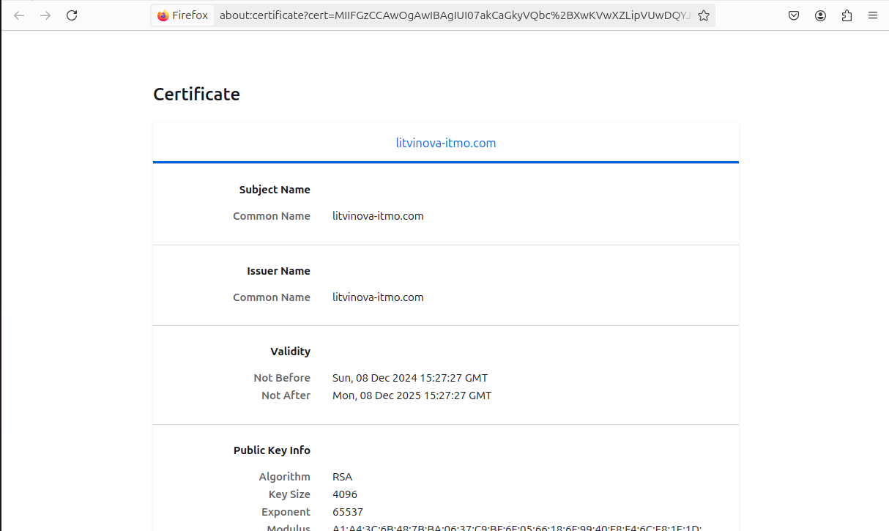
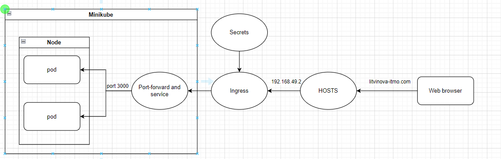

University: [ITMO University](https://itmo.ru/ru/) \
Faculty: [FICT](https://fict.itmo.ru) \
Course: [Introduction to distributed technologies](https://github.com/itmo-ict-faculty/introduction-to-distributed-technologies) \
Year: 2024/2025 \
Group: K4111c \
Author: Litvinova Daria Dmitrievna \
Lab: Lab3 \
Date of create: 12.12.2024 \
Date of finished: -
## Лабораторная работа №3 "Сертификаты и "секреты" в Minikube, безопасное хранение данных."
## Ход работы
1. Создадим файл конфигурации [configmap.yaml](./configmap.yaml), где указаны значения переменных `REACT_APP_USERNAME` и `REACT_APP_COMPANY_NAME`. 
2. Создадим файл конфигурации [deployment.yaml](./deployment.yaml), который создает объект `ReplicaSet` с 2 репликами контейнера `ifilyaninitmo/itdt-contained-frontend:master`
3. Запустим minikube
```bash
minikube start
```
4. Добавим созданные файлы в среду 
```bash
minikube kubectl -- apply -f configmap.yaml
```
```bash 
minikube kubectl -- apply -f deployment.yaml
```
5. Для управления входящим трафиком в создаваемом кластере необходимо включить `Ingress`
```bash
minikube addons enable ingress
```
Ingress — это набор правил внутри кластера Kubernetes, предназначенных для того, чтобы входящие подключения могли достичь сервисов приложений

6. Создадим TLS-сертификат, где зададим такие параметры как `rsa` - ключ шифрования, `days` - срок действия сертификата, выраженный количеством дней. 
```bash
openssl req -new -newkey rsa:4096 -x509 -sha256 -days 365 -nodes -out MyCertificate.crt -keyout MyKey.key -subj "/CN=litvinova-itmo.com"
```
7. Добавим созданые файлы для сертификата в среду, поскольку в п.6 данной работы файлы `MyKey.key` и `MyCertificate.crt` создаются только в рабочей директории.
```bash
minikube kubectl -- create secret tls app-crt --key MyKey.key --cert MyCertificate.crt
```
8. Для создания объекта `Ingress` необходимо создать сервис, аналогично п.5 лабораторной работы 2
```bash
minikube kubectl -- expose replicaset l3-deployment --port=3000 --name=l3-service --type=ClusterIP
```
9. Создадим файл [ingress.yaml](./ingress.yaml)
10. Добавим созданный файл в среду 
```bash
minikube kubectl -- apply -f ingress.yaml
```
11. Чтобы настроить `hosts` необходимо узнать используемый средой ip-адрес.
```bash 
minikube ip
```
а затем добавить в директорию `/etc/host/` свой созданный в п.6 объект и ip-адрес


12. При переходе на `litvinova-itmo.com` получаем следующее:

13. Проверим TLS-сертификат

Таким образом, в данной работе был сгенерирован, импортирован в `minikube` и проверен на наличие в веб приложении TLS-сертификат.

14. Схема организации контейнеров предстпвлена ниже:

