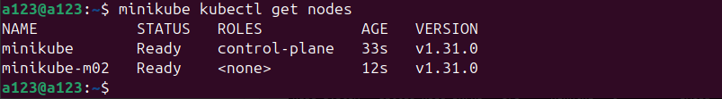
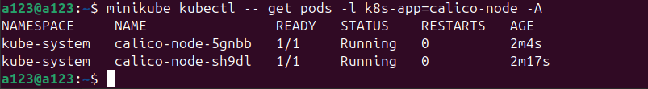
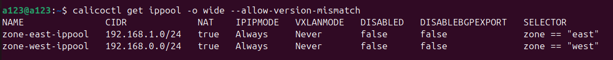
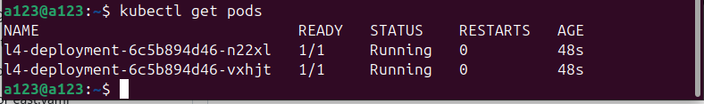
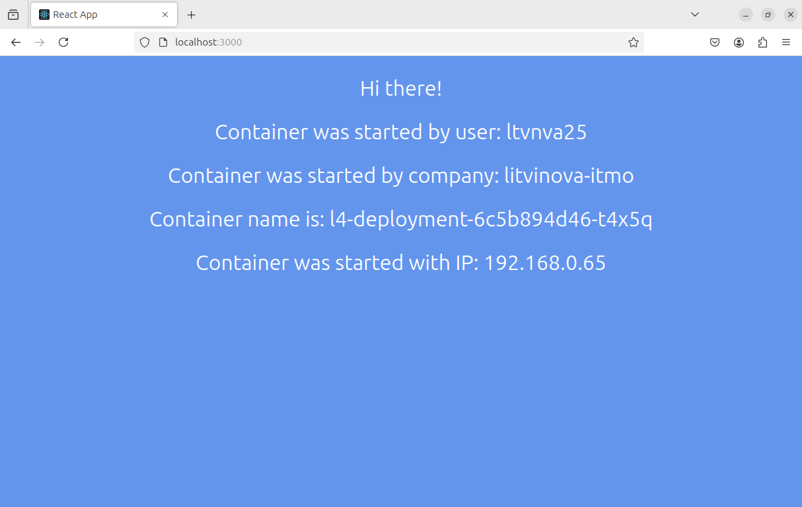
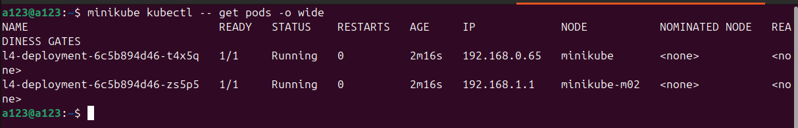
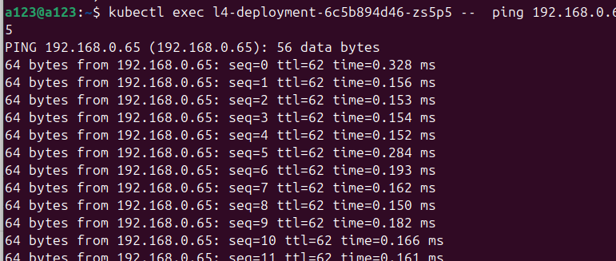
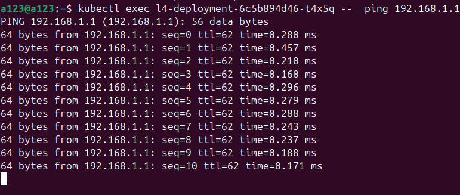
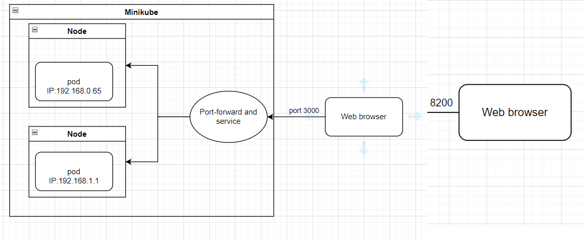

University: [ITMO University](https://itmo.ru/ru/) \
Faculty: [FICT](https://fict.itmo.ru) \
Course: [Introduction to distributed technologies](https://github.com/itmo-ict-faculty/introduction-to-distributed-technologies) \
Year: 2024/2025 \
Group: K4111c \
Author: Litvinova Daria Dmitrievna \
Lab: Lab4 \
Date of create: 12.12.2024 \
Date of finished: -
## Лабораторная работа №4 "Сети связи в Minikube, CNI и CoreDNS"
## Ход работы
1. После предварительной установки `caloco` запустим `minikube`, установив плагин `CNI=calico` и указав количество нод равное 2
```bash
minikube start --network-plugin=cni --cni=calico --nodes 2
```
Плагин CNI (Container Network Interface) - это программный компонент, который отвечает за настройку сетевого взаимодействия контейнеров в Kubernetes, позволяя им общаться друг с другом и с внешним миром.

2. Проверим наличие, количество и имена развернутых нод с помощью:
```bash
minikube kubectl get nodes
```


3.  Далее проверим статус и количество созданных подов:
```bash
minikube kubectl -- get pods -l k8s-app=calico-node -A
```


4. Зададим созданным нодам `label` на основании их географического положения
```bash
minikube kubectl -- label nodes minikube-m02 zone=east
```
```bash
minikube kubectl -- label nodes minikube zone=west
```
Label - это метка, которая прикрепляется к объектам Kubernetes, таким как поды и сервисы, для группировки и фильтрации ресурсов по определенным критериям.

5.  Для назначения нодам необходимых `Ip-pool`, необходимо предварительно удалить созданные автоматически `Ip-pool` с помощью команды:
```bash
minikube kubectl -- delete ippools default-ipv4-ippool
```
IP-pool - это набор IP-адресов, которые могут быть назначены контейнерам в виртуальной сети, чтобы обеспечить им доступ к сети.

6.  Создадим два конфигурационных файла [ippool_west.yaml](./ippool_west.yaml) и [ippool_east.yaml](./ippool_east.yaml). Добавим данные файлы в среду:
```bash
calicoctl create -f ippool_west.yaml --allow-version-mismatch
```
```bash
calicoctl create -f ippool_east.yaml --allow-version-mismatch
```
7.  Проверим правильность приясвоения `зон` 
```bash
calicoctl get ippool -o wide --allow-version-mismatch
```


8. Создадим [конфигурационный файл](./deployment.yaml), где зададим тип объекта- `kind`, его идентификатор `name`, количество реплик `replicas` контейнера `ifilyaninitmo/itdt-contained-frontend:master`.

9. Добавим данный файл в среду, для создания соответствующего объекта с помощью:
```bash
minikube kubectl -- apply -f deployment.yaml
```
10. Создадим сервис, аналогично предыдущим работам
```bash
minikube kubectl -- expose deployment l4-deployment --port=3000 --name=l4-service --type=ClusterIP
```
11. Проверим статус развернутых подов
```bash
kubectl get pods
```


12. Также аналогично предыдущим работам пробросим порты, используя команду:
```bash
minikube kubectl -- port-forward service/l4-service 3000:3000
```
13. При переходе на `localhost:3000` получаем следующую информацию:

Можно заметить, что поду был присвоен адрес из пула, который задавался в п.6. В данной работе подключение произошло к ноде с меткой `west`. Аналогично лабораторной работе 2, переменная `Container name` и `Container IP`, может изменяться, поскольку ее значение зависит от того с каким из созданных контейнеров взаимодействует браузер при переадресации.
14. Для проверки пингования подов необходимо узнать их имена и соответствующие адреса:
```bash
minikube kubectl -- get pods -o wide
```


15. Запустим пинг адресса `192.168.0.65 ` подом, который принадлежит ноде с именеи `minikube`
```bash
kubectl exec l4-deployment-6c5b894d46-zs5p5--  ping 192.168.0.65
```


16. Далее запустим пинг адресса `192.168.1.1 ` подом, который принадлежит ноде с именеи `minikube`
```bash
kubectl exec l4-deployment-6c5b894d46-t4x5q --  ping 192.168.1.1
```

Таким образом, в данной работе были изучены особенности работы с CNI,а также была осуществлена "прослушка" "подов" друг другом.

17. Схема организации контейнеров представлена ниже:

